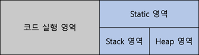

# 자바와 절차적/구조적 프로그래밍

## **자바 프로그램의 개발과 구동**

컴퓨터를 구동하기 위해서는 컴퓨터인 하드웨어, 운영체제, 소프트웨어, 소프트웨어를 개발하기 위한 개발도구가 필요하다. 자바 개발도 이와 같다. 자바 개발도구인 JDK를 이용해 JRE 프로그램을 만들고 JRE는 컴퓨터인 JVM 상에서 구동된다. JDK는 javac.exe를 포함하고 JRE는 자바 프로그램 실행기인 java.exe를 포함한다. 그리고 자바 프로그램을 작성하고 배포하면 JVM이 각 운영체제에 맞게 프로그램을 구동해준다. 이러한 특성을 Write Once Run Anywhere이라고 한다.

실제 배포되는 JDK, JRE, JVM은 편의를 위해 JDK가 JRE를 포함하고 JRE는 JVM을 포함하는 형태로 배포된다.

> **JDK :** Java Development kit
**JRE :** Java Runtime Environment
**JVM :** Java Virtual Machine

객체지향 프로그래밍은 절차적/구조적 프로그램에서 시작되었다. 따라서 절차적/구조적 프로그램의 장점은 받아들이고 단점은 없애 객체지향 언어에 녹아 있다. 자바에서는 절차적 프로그램의 goto를 사용하게 되면 프로그램의 실행순서를 파악하기 어려우므로 예약어로 등록해 사용을 못하게 한다. 그리고 코드의 중복을 줄이기 위해 구조적 프로그램의 함수(메서드)를 유산으로 받았다

자바를 더 잘 활용하기 위해서는 프로그램의 메모리 구조를 알아야한다.

<p align="center"></p>

프로그램 메모리 구조

프로그램 메모리 사용 방식으로 모든 프로그래밍 언어의 공통된 메모리 사용 방식이다. 객체지향 프로그램에서는 데이터 저장영역을 다시 세개의 영역으로 분할해서 다음과 같이 사용한다.

<p align="center"></p>

객체지향 프로그램 메모리 구조

> 위 책에서는 이러한 구조를 T메모리 구조라 칭한다.

## 자바 main()메소드 실행 과정

아래와 같은 코드가 실행될때 T메모리의 변화를 알아보겠다.

```jsx
public class Hello{
	public static void main(String[] args){
		String a = "Hello";
	}
}
```

**1.** **메서드 실행 준비 1단계**

<p align="center"></p>

JRE는 main()메서드가 확인되면 JVM을 작동시키고 JVM은 java.lang패키지를 T메모리의 Static영역에 가져다 놓는다.

**2. 메서드 실행 준비 2단계**

<p align="center"></p>

JVM은 개발자가 작성한 모든 클래스와 임포트 패키지를 스태틱 영역에 가져다 놓는다.

> **main()메서드가 실행되기 전 JVM에서 수행하는 전처리 작업들**
1. java.lang 패키지를 T메모리의 스태틱 영역에 배치한다.
2. import된 패키지를 T메모리의 스태틱 영역에 배치한다.
3. 프로그램 상의 모든 클래스를 T메모리의 스태틱 영역에 배치한다.

**3. main()메서드 스택 프레임**

<p align="center"></p>

main()메서드를 만나면 main() 스택 프레임이 생성된다.

**4. main()메서드 스택 프레임과 인자 변수 공간**

<p align="center"></p>

main()메서드 인자 args를 저장할 변수 공간을 스택프레임의 맨 밑에 확보한다.

**5. 변수 a저장 공간 할당**

<p align="center"></p>

변수 args 위에 변수 a의 공간을 마련한다.

**6. 변수 a에 값 대입**

<p align="center"></p>

변수 a에 "Hello"라는 값을 대입한다.

**7. main()메서드 종료**

<p align="center"></p>

main()메서드의 닫는 중괄호와 만나 스택 프레임이 소멸되고 JRE는 JVM을 종료하고 JRE자체도 운영체제 상의 메모리에서 사라진다.

- **블록 구문과 메모리 : 블록 스택 프레임**

    조건문과 같이 블록 구문이 시작되면 현재 실행되고있는 메서드 안에 블록 스텍 프레임이 생긴다. 그리고 블록을 닫는 중괄호를 만나게 되면 스텍프레임과 함께 변수들이 소멸된다. 따라서   외부 스텍 프레임에서 내부 스택 프레임의 변수에 접근하는 것은 불가능하나 그 역은 가능하다.

- **메서드 호출과 메모리 : 메서드 스택 프레임**

    메서드를 만나면 새로운 스텍 프레임을 생성하게 된다. 스텍 프레임은 자신 외의 다른 스텍 프레임에 접근할 수 없고 반환값에 의해서만 메서드 사이에서 값이 전달될 뿐이다. 즉 서로 내부의 지역 변수를 볼 수 없다는 것이다. 이를 메서드 블랙박스화라 한다.

- **전역 변수와 메모리 : 전역 변수 쓰지 말라니까요!**

    전역변수는 스텍 프레임에 종속적지 않다. 전역변수는 스택 영역의 스텍 프레임에 생성되는 것이 아니라 스태틱 영역의 클래스 안에 변수가 생성된다. 따라서 우리는 스텍 프레임의 생명주기와 관계 없이 언제나 전역변수에 접근이 가능한 것이다.

## 정리

- 절차적/구조적 프로그램을 발전시켜 객체지향적 프로그램 자바가 만들어졌다.
- 자바 프로그램은 JDK, JRE, JVM 통해 만들어진다.
- 프로그램 메모리 구조는 코드영역과 데이터 저장 영역으로 이루어져 있다.
- 객체지향 언어에서 데이터 저장 영역은 스태틱, 스택, 힙으로 이루어져있다.
- 스태틱 : 클래스의 놀이터
스택 : 메서드의 놀이터
힙 : 객체의 놀이터