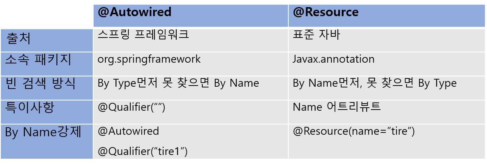

# @Resource 와 @Autowired

**@Resource**와 **@Autowired** 모두 **자동으로 의존성을 주입**해주는 어노테이션이다. 하지만 이 둘에는 차이점이 존재한다.

<p align="center"></p>

## @Autowired

스프링 프레임워크에서 지원하는 어노테이션으로 Type으로 빈을 검색하고 만약 해당 Type의 빈이 여러개일 경우 Name이 일치되는지 빈을 주입한다. **@Qualifier("")**어노테이션을 통해 빈의 우선순위를 결정해줄 수 있다.

```jsx
@Autowired
@Qualifier("name")
Class class;
```

## @Resource

표준 자바에서 지원하는 어노테이션이므로 프레임워크에 종속적이지 않다는 장점이 있다. Name을 통해 빈을 검색하고 만약 Name과 일치하는 빈을 찾지 못했을 경우 일치하는 Type의 빈을 주입시켜준다. **@Resource**의 **name**속성을 통해 빈의 우선순위를 결정해줄 수 있다.

```jsx
@Resource(name="name")
Class class;
```