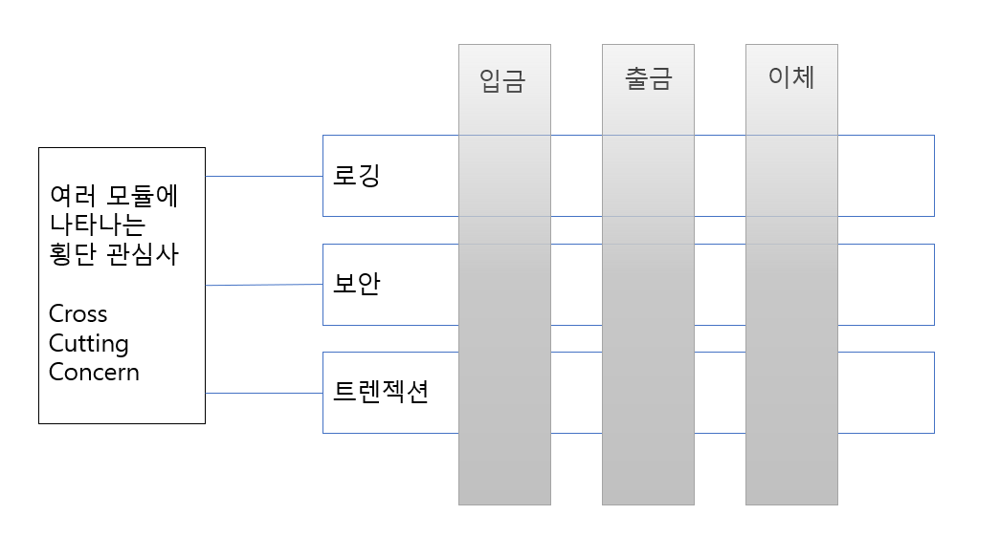
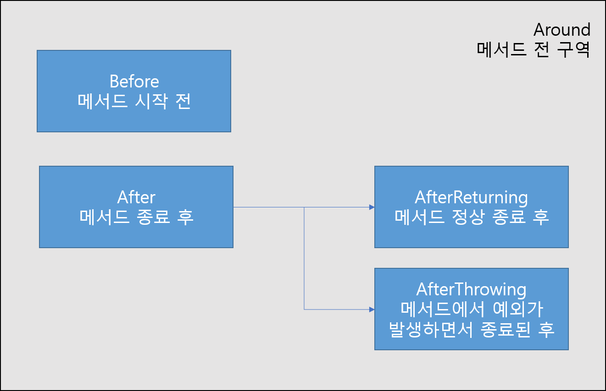
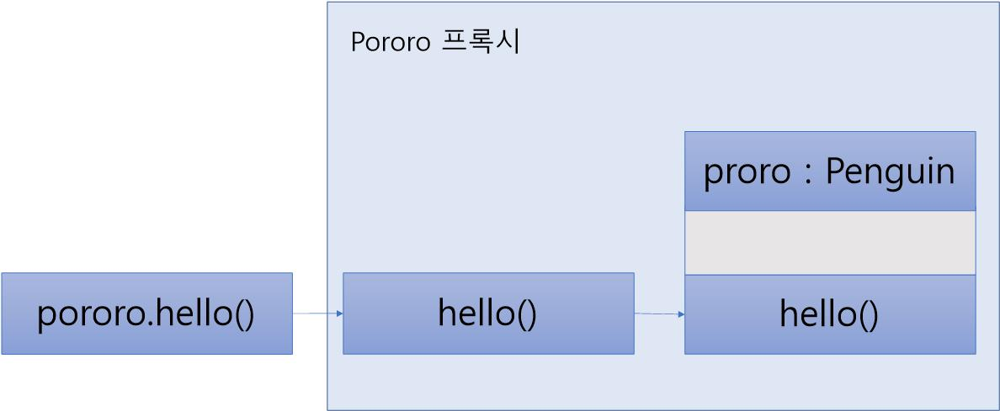

# AOP

**AOP**는 **Aspect-Oriented Programming**의 약자로 이를 번역하면 관점 지향 프로그래밍이 된다. DI가 의존성에 대한 주입이라면 스프링 **AOP**는 **로직 주입**이라고 할 수 있다.

위 그림을 보면 입금, 출금, 이체 모듈에서 로깅, 보안, 트렌젝션 기능이 반복적으로 나타나는 것을 볼 수 있다. 프로그래밍을 작성하다 보면 이처럼 다수의 모듈에 공통적으로 나타나는 부분이 존재하는데 바로 이것을 **횡단 관심사**라고 한다. 이러한 **횡단 관심사의 중복을 AOP를 통해 해결**한다.

> 코드 = 핵심 관심사 + 횡단 관심사

AOP는 로직에대한 주입이고 객체지행에서 로직이 있는 곳은 메서드의 안쪽이다. **메서드에서 코드를 주입할 수 있는 곳은** **Around, Before, After, After Returning, After Throwing**으로 총 5군데다

**스프링 AOP를 이해하기 위해서는 5가지 용어를 알아야한다.**

- **Aspect** : 여러 개의 Advice와 여러 개의 Pointcut의 결합체
- **Advisor** : 한 개의 Advice + 한 개의 Pointcut
- **Advice** : pointcut에 적용할 로직
- **JoinPoint** : Pointcut의 후보가 되는 모든 메서드 즉 Aspect 적용이 가능한 지점
- **Pointcut** : 횡단 관심사를 적용할 타깃 메서드를 선택하는 지시자

**스프링 AOP는 프록시를 통해서 동작한다.**

pororo객체의 hello()메서드는 프록시를 통해 호출되게된다. 그런데 스프링 AOP에서는 호출하는쪽에서나 호출당하는 쪽 그 누구도 프록시가 존재한다는 사실을 모른다. 오로지 스프링 프레임워크만이 프록시의 존재를 알고있다.

**스프링 AOP의 핵심은 다음과 같다.**

- 인터페이스 기반이다.
- 프록시 기반이다.
- 런타임 기반이다.